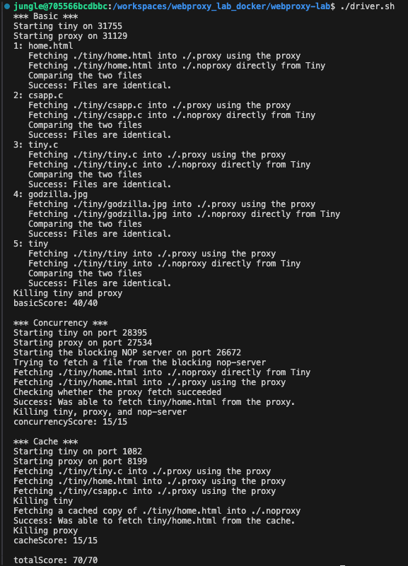

# 동적 웹 프록시(Web Proxy), Echo, Tiny 서버 구현
HTTP/1.0 기반의 학습용 네트워크 스택을 단계적으로 구현
- Echo server: TCP 반복 서버/클라로 RIO 견고 I/O와 소켓 기본기를 확립
- Tiny server: 정적/동적(Adder CGI) 웹서버 구현, HEAD 일부 지원
- Proxy server: 순차 프록시 → 스레드 병렬 → LRU 캐싱으로 발전

## 과제의 의도

- 네트워크 프로그래밍의 기초: 소켓, 리슨/어셉트, 커넥트, 반복 서버, 부분 읽기/쓰기 처리
- HTTP 프로토콜 이해: 요청/응답 라인, 헤더 파싱, Hop-by-hop 필터링, 헤더 재작성
- 동시성과 공유자원: 스레드, detach, 락, 조건변수, RWLock 설계
- 성능/품질: 캐시 적중률, 처리량(throughput), 안정성의 균형

## 프로젝트 구성

- Echo: `webproxy-lab/echo/`
- Tiny: `webproxy-lab/tiny/`
- Proxy: `webproxy-lab/` (proxy.c, cache.c|h, thread.c)
- 공용 유틸: `webproxy-lab/tiny/csapp.[ch]` (RIO, 안전 래퍼)

## 구현 서버 목록

### 1. Echo 서버
- 서버: 반복(Iterative) 서버. `Open_listenfd` → `Accept` → `echo(connfd)` → `Close`
- 처리: `rio_readlineb`로 한 줄 수신, `Rio_writen`으로 정확히 n바이트 에코
- 클라이언트: 표준입력 라인 → 서버 송신 → 에코 수신 출력
- 소스: `webproxy-lab/echo/echoserver.c`, `webproxy-lab/echo/echo.c`, `webproxy-lab/echo/echoclient.c`

### 2. Tiny 서버

- 핵심 흐름: `doit` → `parse_uri` → 정적(`serve_static`) / 동적(`serve_dynamic`)
- 정적: MIME 추론, 헤더 작성, 파일 바디 전송; HEAD 지원 시 바디 생략
- 동적: CGI(Adder) 실행. `QUERY_STRING` 설정, `dup2(fd, stdout)`, `execve`
- 구현 포인트:
  - 정적 바디는 `Malloc + Rio_readn` 사용(주석으로 `mmap` 대안 설명)
  - MIME 확장(mp4, mpeg 등)
  - HEAD for CGI는 501로 처리
- 소스: `webproxy-lab/tiny/tiny.c`, `webproxy-lab/tiny/cgi-bin/adder.c`

### 3. Proxy 서버 파트별 구현

- **Part 1 — 순차 프록시**
  - 목표: 단일 스레드 GET 프록시, 헤더 재작성, 바이너리 안전 스트리밍
  - 파이프라인: 요청 파싱 → `connect_end_server` → 요청/헤더 전송 → 응답 스트리밍
  - 정책:
    - HTTP/1.0로 다운그레이드
    - Host 보정/추가
    - User-Agent 고정 문자열
    - Connection/Proxy-Connection: close
    - Hop-by-hop 헤더 필터
  - 견고성: RIO로 부분 읽기 방어, `writen_all`로 부분 쓰기 보정, `SIGPIPE` 무시

- **Part 2 — 스레드 병렬 처리(thread-per-connection)**
  - 목표: 동시 요청 처리
  - 구현: `spawn_detached_worker`가 `pthread_create`로 워커 생성 → 즉시 detach → `handle_client` 수행
  - 안정성: EINTR 재시도, 에러 경로에서 FD 정리 보장

- **Part 3 — 캐싱 웹 오브젝트(LRU, RWLock)**
  - 목표: 반복 URI의 지연 감소, 원서버 트래픽 절약
  - 정책: 총 용량 1MiB(`MAX_CACHE_SIZE`), 단일 객체 100KiB(`MAX_OBJECT_SIZE`)
  - 구조: 이중 연결 리스트 LRU(head 최신, tail 가장 오래됨), 용량 초과 시 꼬리 방출
  - 동기화: `pthread_rwlock_t`로 읽기 병행(조회), 쓰기 단독(삽입/방출)
  - 캐싱 조건: 응답 스트리밍 도중 전체 크기가 `MAX_OBJECT_SIZE` 이하일 때만 메모리에 누적 후 `cache_put`

## 구현 기능 목록 / 구현한 방식

- 요청 처리 `handle_client(int connfd)`: 파싱 → 검증(GET) → URI 분해 → 캐시 조회 → 서버 연결 → 요청 라인/헤더 전송 → 응답 스트리밍(+조건부 캐시)
- URI 파서 `parse_uri`: `http://host[:port]/path`만 지원, 포트 유효성 체크, 기본 포트 80
- 헤더 재작성 `forward_request_headers`:
  - Host 유지/보정, User-Agent/Connection/Proxy-Connection 고정, Hop-by-hop 필터, 빈 줄 처리
- 응답 중계 `relay_and_maybe_cache`: 바이너리 안전 스트리밍, 임계 크기 이하만 캐시 버퍼에 누적 후 삽입
- 연결 함수 `connect_end_server`: `getaddrinfo` 후보 순회로 TCP connect, IPv4/IPv6 지원
- 리스닝 함수 `open_listenfd_s`: `AI_PASSIVE|AI_ADDRCONFIG|AI_NUMERICSERV`, `SO_REUSEADDR`, `bind/listen`
- 스레딩 `thread.c`:
  - 연결당 스레드 생성, 즉시 detach, 인자 구조체 해제와 FD 정리
- 캐시 `cache.c|h`:
  - API: `cache_init`, `cache_get`, `cache_put`, `cache_destroy`
  - 조회 시 복사본 반환, 이후 짧은 구간 쓰기락으로 LRU 승격
  - 삽입 시 동일 키 교체 및 용량 확보 후 head 삽입

## 빌드/테스트 결과

- 상위 Makefile: `make -C webproxy-lab` → `proxy` / `tiny/tinyserver` 생성
- Echo: `make -C webproxy-lab/echo` → `echo_server`, `echo_client`
- 시나리오
  - Echo: 여러 클라이언트 동시 연결, 에코 확인
  - Tiny: 정적(`home.html`, `sample.mp4`), 동적(`cgi-bin/adder?x=3&y=5`) 직접/프록시 경유 비교
  - Proxy: 동일 URI 반복 요청 → 캐시 HIT 응답 시간 개선 확인, 잘못된 메서드/URI/호스트 에러 경로 검증

느낀 점

echo 서버라는 아주 단순한 서버부터 점진적으로 발전하여 정적/동적을 각각 처리하는 Tiny server, 그리고 가장 어려웠던 Client와 Tiny Server 사이의 Proxy 서버를 구현하며, "서버"라는 개념과 동작 과정을 직접 체감할 수 있었다.
 

정확히 문자열을 파싱하고 다루는 것이 서버 구현의 핵심인 것 같다. 헤더 길이, CRLF, 대소문자, 누락 케이스를 모두 처리할 수 있어야 오류 없는 서버를 만들 수 있다는 것과 HTTP는 텍스트지만 요청줄/헤더/CRLF/빈 줄의 경계와 MIME/Content-Length 아주 정확히 담아서 전달할 수 있어야 했다. 한 글자만 틀려도 브라우저가 멈추거나 잘못 해석해버린다.
 

Proxy 서버를 만들 때가 가장 어려웠던 것 같다. Host, User-Agent, Connection: close, Proxy-Connection: close를 정규화해야 서버/프록시/클라이언트가 모두 같은 연결 수명 정책을 가질 수 있게 되고, 이 과정에서 “브라우저가 보내는 다양한 헤더를 다 믿지 않고, 규칙대로 정리한다”는 프록시의 역할을 알게 되었다.
 

Part 1의 한 클라이언트씩 처리하는 순차적 프록시를 넘어 Part 2의 스레드를 이용한 병렬 처리 프록시, Part 3의 캐싱 웹 오브젝트 기능을 추가한 프록시를 구현하며 서버의 다양한 역할과 최적화를 직접 체감할 수 있었다.

## 참고문헌
- CS:APP(3판) Ch. 11 – Network Programming, Web Proxy Lab

